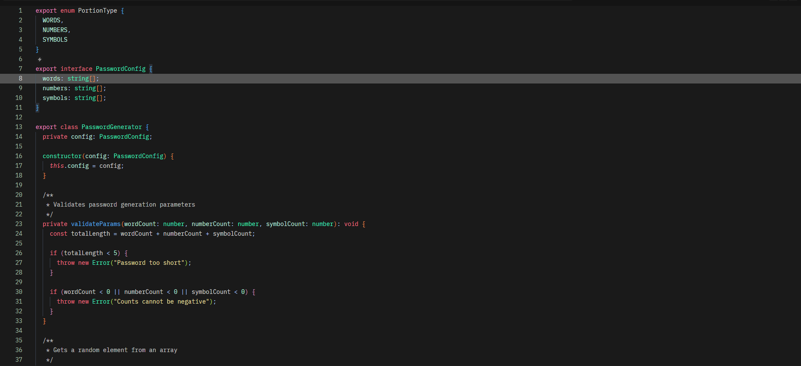
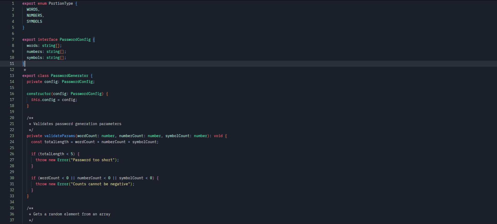
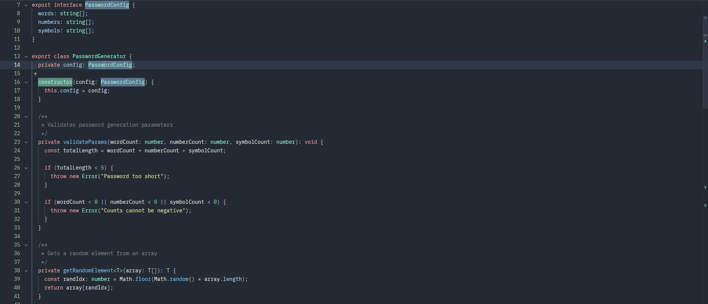
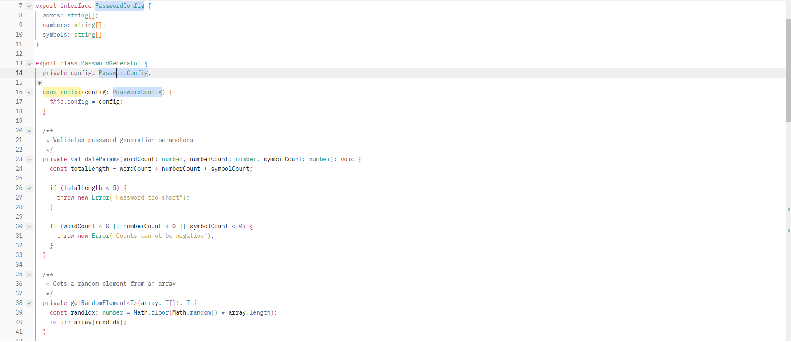

# Godot Engine Theme

## Introduction

This theme takes direct inspiration from the Godot Engine's editor, borrowing its clean, dark aesthetic and distinctive accent colors. I've always been a huge fan of how readable and visually balanced the Godot interface feels, and I wanted to capture that same vibe in zed. 

## Previews

**Godot Dark**
                                                                         |

**Godot Blue**
     

**Godot Light Blue**
     

**Godot Light**
     

## Installation

Install this theme from the extension panel: search for "_Day Shift Theme_".

You can find this theme in the Zed extension Marketplace.

## Support
Do not hesitate to contact me if you have any problems. I'm open to all suggestions and concerns!
